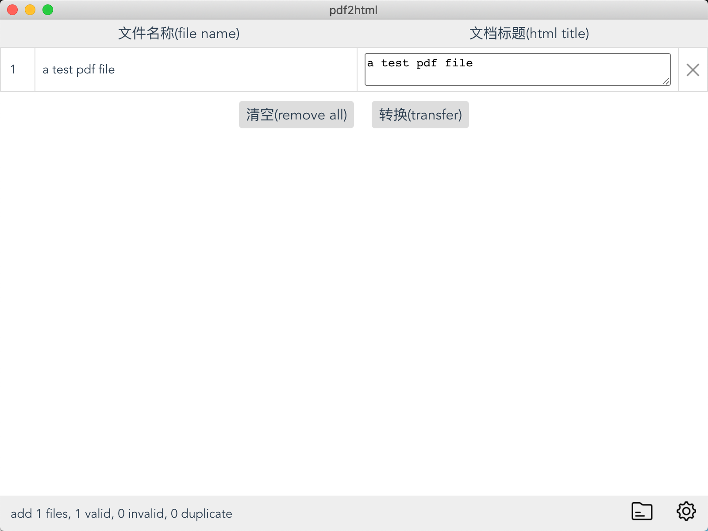
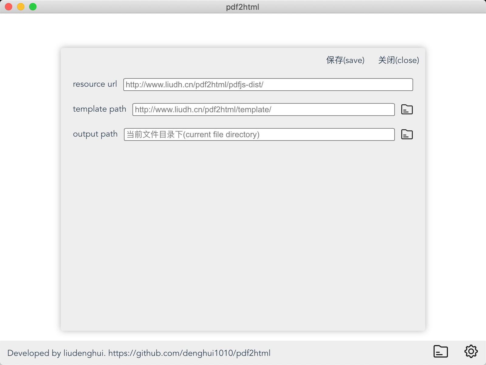

<div align="right"><strong>🇨🇳<a href="./README_CN.md">中文</a></strong> | <strong>🇬🇧English</strong></div>

# pdf2html
this app can transfer pdf file to html file



## Dependencies
 - [electron](https://github.com/electron/electron)
 - [vue-cli-plugin-electron-builder](https://github.com/nklayman/vue-cli-plugin-electron-builder)
 - [vue](https://github.com/vuejs/vue)
 - [pdfjs](https://github.com/mozilla/pdf.js)
 - [art-template](https://github.com/aui/art-template)

## Features
- just output one html file
- resouece url configurable
- template path configurable
- linux/mac/window support

## Resources
1. the resources now in personal server, suggest put folder ```/public/pdfjs-dist``` into your own server
2. the templates now in personal server, suggest put folder ```/public/template``` into your own server
3. finish this, you can modify the setting in the app
   - resource url only support url
   - template path support url and local path
4. you can modify the resources and templates, so that the final output html will be changed.



## Download


## Develop
```
npm install
npm run electron:serve
```

## Build
read more [electron-builder doc](https://www.electron.build/cli)
- mac & linux & window
  - ```npm run electron:build -- -mwl```
- mac
  - ```npm run electron:build -- --mac```
- linux
  - ```npm run electron:build -- --linux deb tar.xz```
- window
  - ```npm run electron:build -- --win nsis```

## LICENSE
[Apache License](/LICENSE)
